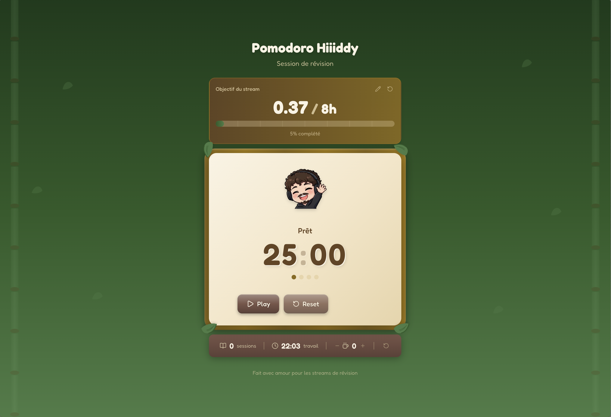
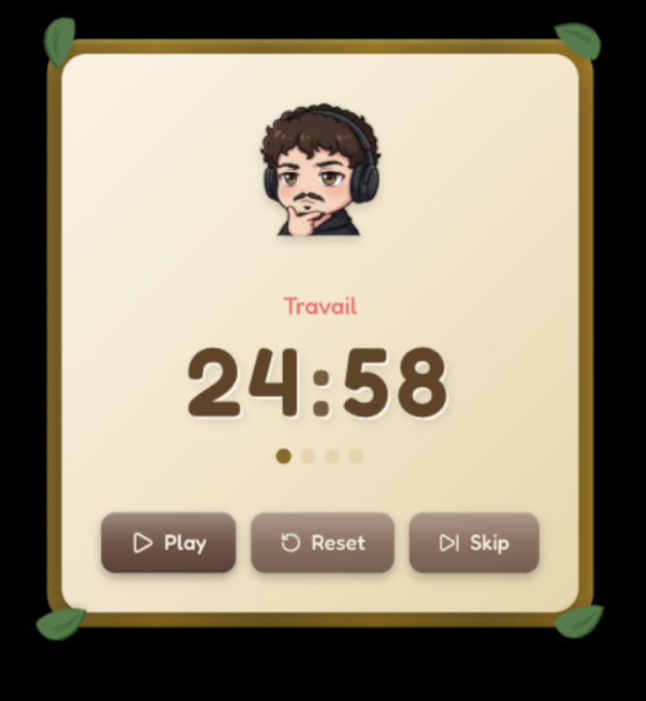
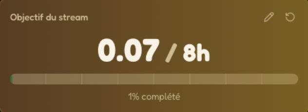
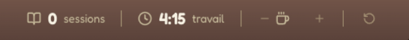

<div align="center">

# Pomodoro Hiiiddy

### Un timer Pomodoro personnalisé pour les streams de révision

[](https://nextjs.org/)
[](https://www.typescriptlang.org/)
[](https://tailwindcss.com/)
[](https://www.framer.com/motion/)

[Demo Live](https://pomodoro-hiiiddy.vercel.app) · [Signaler un Bug](https://github.com/SweathX/Pomodoro-Hiiiddy/issues)

</div>

---

## Aperçu

Timer Pomodoro moderne avec un thème **forêt/bambou cozy**, conçu pour accompagner les sessions de streaming éducatives. S'intègre parfaitement avec **OBS/Streamlabs** grâce aux overlays dédiés avec fond transparent.



## Fonctionnalités

| Fonctionnalité | Description |
|----------------|-------------|
| **Timer Pomodoro** | Cycles de travail (25 min), pause (5 min) et pause longue (15 min) |
| **Statistiques** | Sessions complétées et temps de travail en temps réel |
| **Objectif de stream** | Barre de progression vers un objectif d'heures personnalisable |
| **Compteur de café** | Suivez votre consommation de café pendant le stream |
| **Emotes animées** | Les emotes changent selon l'état du timer |
| **Son de notification** | Alerte sonore à chaque transition |
| **Overlays OBS** | 3 overlays avec fond transparent pour le stream |
| **Persistance** | Stats sauvegardées automatiquement |

## Overlays pour OBS/Streamlabs

<div align="center">
<table>
<tr>
<td align="center">

<br/>
<strong>Timer</strong>
<br/>
<code>/overlay</code>
</td>
<td align="center">

<br/>
<strong>Objectif</strong>
<br/>
<code>/overlay/objective</code>
</td>
<td align="center">

<br/>
<strong>Stats</strong>
<br/>
<code>/overlay/stats</code>
</td>
</tr>
</table>
</div>

## Stack Technique

- **Next.js 15** - Framework React avec App Router
- **React 19** - Librairie UI
- **TypeScript** - Typage statique
- **Tailwind CSS v4** - Styling utilitaire
- **Framer Motion** - Animations fluides
- **Zustand** - Gestion d'état globale avec persistance
- **Lucide React** - Icônes

## Installation

```bash
# Cloner le repository
git clone https://github.com/SweathX/Pomodoro-Hiiiddy.git

# Aller dans le dossier
cd Pomodoro-Hiiiddy

# Installer les dépendances
npm install

# Lancer en développement
npm run dev
```

Le projet sera accessible sur `http://localhost:3000`

## Utilisation avec OBS/Streamlabs

### Ajouter un overlay

1. Dans OBS/Streamlabs, ajoutez une source **Navigateur**
2. Entrez l'URL de l'overlay souhaité :

| Overlay | URL | Dimensions |
|---------|-----|------------|
| Timer | `https://pomodoro-hiiiddy.vercel.app/overlay` | 500 x 520 |
| Objectif | `https://pomodoro-hiiiddy.vercel.app/overlay/objective` | 500 x 200 |
| Stats | `https://pomodoro-hiiiddy.vercel.app/overlay/stats` | 550 x 80 |

3. Le fond transparent fonctionne automatiquement
4. Utilisez **clic droit → Interagir** pour contrôler le timer

### Synchronisation

Tous les overlays dans OBS/Streamlabs sont **automatiquement synchronisés** entre eux via le localStorage partagé.

## Personnalisation

### Emotes

Remplacez les fichiers dans `/public/emotes/` :

| Fichier | État |
|---------|------|
| `wave.png` | Accueil (idle) |
| `think.png` | Travail |
| `happy.png` | Pause |
| `sleep.png` | Pause longue |
| `stars.png` | Milestone |
| `heart.png` | Favicon |

### Son de notification

Remplacez `/public/sounds/notification.mp3` par votre propre son.

## Structure du projet

```
src/
├── app/
│   ├── layout.tsx              # Layout principal
│   ├── page.tsx                # Page complète
│   └── overlay/
│       ├── page.tsx            # Overlay Timer
│       ├── objective/page.tsx  # Overlay Objectif
│       └── stats/page.tsx      # Overlay Stats
├── components/
│   ├── Timer.tsx               # Timer principal
│   ├── TimerDisplay.tsx        # Affichage MM:SS
│   ├── Controls.tsx            # Boutons de contrôle
│   ├── Stats.tsx               # Panneau statistiques
│   ├── ObjectiveDisplay.tsx    # Objectif de stream
│   ├── Emote.tsx               # Emotes animées
│   ├── BambooFrame.tsx         # Cadre bambou
│   └── WoodButton.tsx          # Boutons style bois
├── stores/
│   └── timerStore.ts           # État Zustand
└── hooks/
    └── useTimer.ts             # Logique timer
```

## Licence

MIT

---

<div align="center">

Fait avec amour pour les streams de révision

**[SweathX](https://github.com/SweathX)**

</div>
